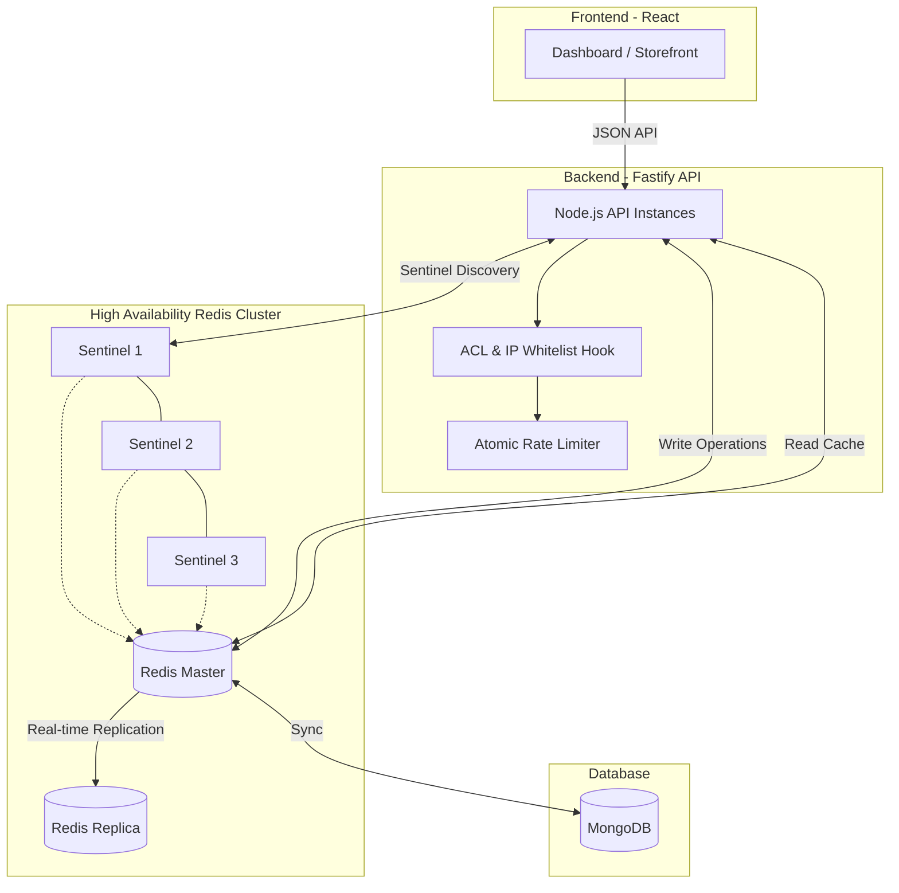

# Redis Mastery POC: High-Concurrency Flash Sale Platform

## 📋 Executive Summary (For Dev Team)
This POC demonstrates a production-grade implementation of Redis beyond basic caching. We simulate a **Black Friday Flash Sale** scenario where sub-millisecond performance and data integrity are non-negotiable. It showcases how to handle millions of unique visitors, prevent inventory overselling using distributed locks, and ensure 99.99% uptime through a Sentinel-managed High Availability cluster.

---

## 🏗️ System Architecture (Mermaid Diagram)



---

## 🚀 Key Use Cases

### 1. Beginner: String Caching & TTL (Product Catalog)
- **Problem**: Database heavy queries slow down the UI.
- **Solution**: Cache-Aside pattern with 5-minute TTL.
- **Benefit**: Reduces MongoDB load by 90% for hot items.

### 2. Intermediate: Atomic Counters & Rate Limiting (DDoS Protection)
- **Problem**: API abuse from single IPs.
- **Solution**: Explicit `INCR` + `EXPIRE` logic in Fastify hooks.
- **Constraint**: Pure `ioredis` implementation without 3rd party libs for deep learning.

### 3. Intermediate: HyperLogLog (Unique Analytics)
- **Problem**: Tracking 1M+ unique visitors uses too much RAM.
- **Solution**: `PFADD` / `PFCOUNT`. 
- **Efficiency**: Stores millions of unique IDs in constant **12KB** of memory.

### 4. Advanced: Sorted Sets (Live Leaderboards)
- **Problem**: Calculating "Trending Products" is slow in SQL/NoSQL.
- **Solution**: `ZINCRBY` on sales events.
- **Benefit**: O(log(N)) retrieval of Top 5 items in real-time.

### 5. Advanced: Distributed Locking (Inventory Integrity)
- **Problem**: Concurrency race conditions (Overselling stock).
- **Solution**: `SET NX PX` with a Lua-scripted atomic release and retry logic with jitter.
- **Benefit**: Ensures only the available stock is sold even if 10k users click at once.

### 6. Expert: High Availability (Replication & Sentinel)
- **Problem**: System crashes if the Redis server goes down.
- **Solution**: Master-Replica replication with 3-node Sentinel quorum.
- **Benefit**: Automatic failover in < 5 seconds. The app remains alive if any node dies.

---

## 🛠️ Tech Stack & Security
- **Backend**: Fastify, TypeScript, `ioredis`, `mongoose`.
- **Frontend**: React (Vite), TailwindCSS (Glassmorphism UI).
- **Security**: 
  - **SASL/ACL**: Dedicated `api_user` with "Principle of Least Privilege".
  - **IP Whitelisting**: Application-level middleware for trusted network access.

---

## 🧪 Testing Guide

### 1. The Concurrency Test (Distributed Locking)
Click the **"Buy (Stress)"** button in the UI. 
- It fires 10 simultaneous requests. 
- Observe the **System Monitor** logs showing users acquiring/releasing locks and waiting (retrying) to ensure no stock is "double-sold."

### 2. The Failover Test (High Availability)
1. Start the local HA cluster: 
   ```bash
   # Run Master, Replica, and 3 Sentinels from /infra/local-ha
   ```
2. Kill the Master process (`Ctrl+C`).
3. Observe the Sentinels "voting" and promoting the Replica to Master.
4. Refresh the UI—the system continues to function seamlessly.

### 3. Rate Limiter Test
```bash
for i in {1..12}; do curl -i http://localhost:3000/api/products; sleep 0.5; done
```
*Expected: Requests 11-12 return HTTP 429.*
